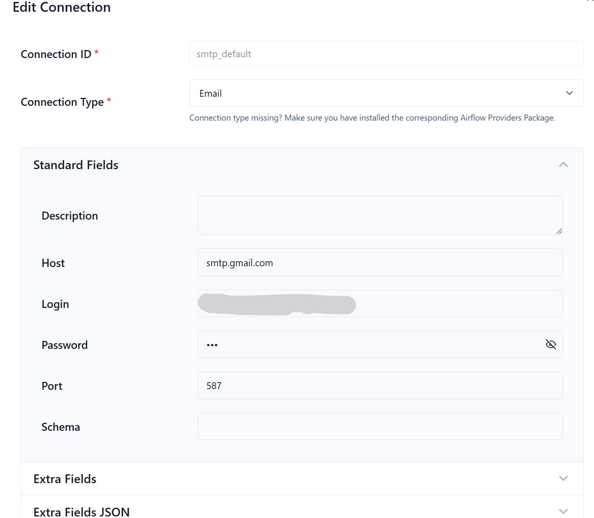
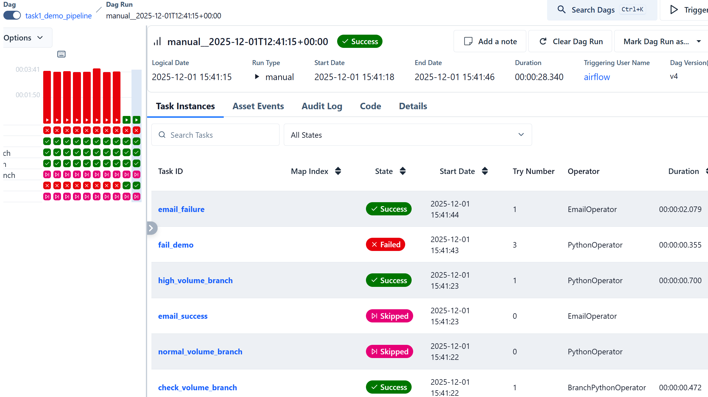

### **Название задачи: Выбор и реализация решения для пакетной обработки данных** 
### **Автор:**
### <a name="_uanumrh8zrui">01.12.2025</a>**Дата:**
### **Функциональные требования**
| **№** | **Действующие лица или системы** | **Use Case**                                   | **Описание**                                                                               |
| :---: | :------------------------------- | :--------------------------------------------- | :----------------------------------------------------------------------------------------- |
|   1   | Маркетинговый отдел              | Формирование отчётов из разнородных источников | Объединение данных из CSV, PostgreSQL, Kafka и других источников в единый отчётный датасет |
|   2   | Система пакетной обработки       | Запуск и мониторинг ETL-пайплайнов             | Позволяет выполнять повторяемые, отслеживаемые, устойчивые к сбоям процессы                |
|   3   | Администратор                    | Настройка уведомлений и политик повтора        | Настройка email/SMS-оповещений и автоматических повторов при сбое                          |
|   4   | DevOps/Инженер                   | Интеграция с облачными системами               | Подключение к BigQuery, Redshift, Spark и другим внешним API                               |

### **Нефункциональные требования**

| **№** | **Требование**                                                         |
| :---: | :--------------------------------------------------------------------- |
|   1   | Поддержка интеграции с BigQuery, Redshift, Kafka, Spark и внешними API |
|   2   | Возможность ветвления, условных переходов и event-triggered запусков   |
|   3   | Наличие встроенных механизмов retry и fallback                         |
|   4   | Возможность отправки email-уведомлений при завершении/ошибке           |
|   5   | Подходящая архитектура для развёртывания в облаке                      |
|   6   | Поддержка мониторинга и логирования из коробки                         |
|   7   | Масштабируемость при объёмах ~1 млн строк за запуск                    |

### **Решение**
Рекомендую выбрать Apache Airflow — он идеально подходит под все требования задания:
- Есть готовые коннекторы: BigQuery, Redshift, Kafka, Spark, PostgreSQL, S3/GCS и т.д.
- Поддерживает ветвление (BranchPythonOperator), условия, trigger rules.
- Есть встроенные retry, email-уведомления (EmailOperator/SmtpOperator), Slack, Telegram и т.д.
- Легко деплоится в облаке (Cloud Composer, MWAA, Helm-чарт в GKE/EKS).
- Наличие веб-интерфейса — интерфейс предоставляет визуализацию DAG-графов, историю запусков, логи и управление повторными попытками.

Архитектурно Airflow работает как **оркестратор**, а не как исполнитель тяжёлых вычислений. Это даёт возможность гибко интегрировать **Spark** для тяжёлой аналитики, **Kafka** для событий и **SQL-движки** — без жёсткой привязки.

### **Альтернативы**

| Критерий                                   | Apache Airflow                  | Spring Batch                                 | Kubernetes CronJob                        | Apache Spark                                       |
| ------------------------------------------ | ------------------------------- | -------------------------------------------- | ----------------------------------------- | -------------------------------------------------- |
| Интеграция с BigQuery/Redshift/Kafka/Spark | ✅ Более 200 провайдеров         | ❌ Только через кастомный код                 | ❌ Требует ручной реализации               | ✅ Через DataSource API, но фокус не на оркестрации |
| Условные переходы / ветвление              | ✅ Встроено                      | ❌ Только через кастомную логику              | ❌ Невозможно                              | ❌ Только через отдельные job-ы                     |
| Retry / fallback / уведомления             | ✅ Гибкие политики + callbacks   | ✅ Только retry, fallback сложен              | ❌ Только через initContainers или sidecar | ❌ Без внешнего оркестратора – нет                  |
| Развёртывание в облаке                     | ✅ Готовые managed-сервисы + K8s | ✅ Но требует JVM и Spring-экосистемы         | ✅ Но ограничен Cron-логикой               | ✅ Но требует кластера (EMR, Dataproc и т.п.)       |
| Мониторинг и UI                            | ✅ Веб-GUI, логи, метрики        | ❌ Только через Actuator + внешний мониторинг | ❌ Только через K8s logs/events            | ✅ Spark UI, но не для DAG-оркестрации              |

Airflow выделяется как специализированный оркестратор пайплайнов, тогда как:
- Spring Batch лучше подходит для JVM-монолитов и глубокой транзакционной обработки записей, но не для сложных DAG или внешних интеграций.
- Kubernetes CronJob — это просто расписание, без логики ветвления, retry-стратегий и UI.
- Spark, несмотря на производительность при обработке больших данных, не предназначен для оркестрации и управления workflow.

### **Демонстрация PoC**

