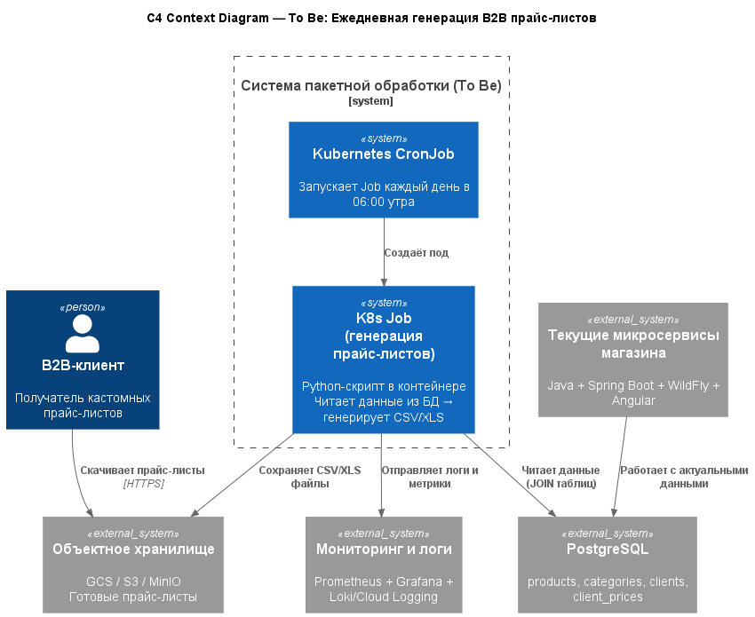

### <a name="_b7urdng99y53"></a>**Название задачи: Разработка дизайна модуля покетной обработки** 
### <a name="_hjk0fkfyohdk"></a>**Автор:**
### <a name="_uanumrh8zrui">01.12.2025</a>**Дата:**
### <a name="_3bfxc9a45514"></a>**Функциональные требования**
| №   | Действующие лица или системы       | Use Case                          | Описание                                                           |
| --- | ---------------------------------- | --------------------------------- | ------------------------------------------------------------------ |
| 1   | Планировщик (Kubernetes CronJob)   | Запуск генерации прайс-листов     | Каждый день в 06:00 запускает Job                                  |
| 2   | K8s Job (Python-скрипт)            | Генерация кастомных прайс-листов  | Читает данные из PostgreSQL, формирует CSV/XLS для каждого клиента |
| 3   | Объектное хранилище (GCS/S3/MinIO) | Хранение готовых прайс-листов     | Клиенты скачивают файлы по ссылке или через портал                 |
| 4   | B2B-клиенты                        | Получение актуальных прайс-листов | Скачивают свои персонализированные файлы                           |


### <a name="_u8xz25hbrgql"></a>**Нефункциональные требования**
| №   | Требование                                                             |
| --- | ---------------------------------------------------------------------- |
| 1   | Запуск строго по расписанию (ежедневно в 06:00)                        |
| 2   | Обработка 5 000 – 20 000 строк за < 30 секунд                          |
| 3   | Минимальное потребление ресурсов (не более 1 CPU, 512 Mi RAM)          |
| 4   | Автоматический retry при сбое (минимум 3 попытки)                      |
| 5   | Логи и метрики доступны в централизованной системе мониторинга         |
| 6   | Полная совместимость с существующей микросервисной архитектурой на K8s |

### <a name="_qmphm5d6rvi3"></a>**Решение**

| Критерий                                                       | Spring Batch                | Apache Airflow                     | K8s Job (рекомендую)                                                         | Spark                   |
| -------------------------------------------------------------- | --------------------------- | ---------------------------------- | ---------------------------------------------------------------------------- | ----------------------- |
| Наличие конфигурации CRON-расписания                           | Нет, нужен внешний          | Да, встроенный                     | Да, через CronJob                                                            | Нет, нужен внешний      |
| Сложность реализации логики по обработке данных                | Низкая (ItemReader/Writer)  | Средняя (DAG + Python)             | Низкая–средняя  (один SQL-запрос + экспорт в CSV, без сложной бизнес-логики) | Высокая (DataFrame API) |
| Ресурсоёмкость решения                                         | Высокая (JVM)               | Средняя                            | Низкая                                                                       | Очень высокая           |
| Масштабируемость под нагрузкой                                 | Средняя                     | Высокая                            | Высокая (горизонтально)                                                      | Очень высокая           |
| Сложность развёртывания в облаке и интеграция с микросервисами | Средняя (нужен Spring Boot) | Высокая (отдельная инфраструктура) | Низкая (нативно в K8s)                                                       | Высокая (нужен кластер) |
| Удобство интеграции с системами логирования и мониторинга      | Через Spring Actuator       | Отличное (встроено)                | Отличное (K8s + Loki/Prometheus)                                             | Среднее (Spark UI)      |

Выбор пал на K8s Job - так как задача простая, одноразовая и не требует сложной логики. CronJob является нативным механизмом Kubernetes для периодических задач, легко интегрируется с существующей микросервисной архитектурой, потребляет минимальные ресурсы и не требует развёртывания дополнительной инфраструктуры. Логирование и мониторинг реализуются через стандартные средства K8s

### <a name="_bjrr7veeh80c"></a>**Диаграмма**
[Код диаграммы](diagramm.puml)



### <a name="_bjrr7veeh80c"></a>**Верхнеуровневый пошаговый план конфигурации и имплементации**

1. Разработать Python-скрипт `generate_price_lists.py` (чтение из PostgreSQL → группировка по клиенту → CSV → загрузка в GCS/S3).
2. Создать `Dockerfile` на базе `python:3.11-slim`.
3. Подготовка Kubernetes-манифестов
   - Создать job.yaml
   - `CronJob.yaml` с расписанием `0 6 * * *`,
4. Тестирование в локальном кластере
   - Запустить Minikube:
      ``` bash
        minikube start
        ```
    - Загрузить образ в Minikube:
        ``` bash
        minikube image load price-list-exporter:latest
        ```
    - Применить манифесты:
        ``` bash 
        kubectl apply -f secret.yaml
        kubectl apply -f configmap.yaml
        kubectl apply -f cronjob.yaml
        ```
5. Валидация результата
6. Добавление метрик через `prometheus-client` (опционально).