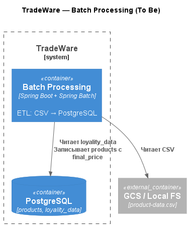

### **Название задачи:** Реализация ETL с использованием Spring Batch  
### **Автор:** Александр  
### **Дата:** 03.12.2025

### **Функциональные требования**

|   №   | Действующие лица или системы      | Use Case                    | Описание                                                                                                           |
| :---: | --------------------------------- | --------------------------- | ------------------------------------------------------------------------------------------------------------------ |
|   1   | Файловая система (CSV)            | Загрузка данных о товарах   | Чтение файла `product-data.csv` с полями: `productId`, `productSku`, `productName`, `productAmount`, `productData` |  |
|   2   | PostgreSQL                        | Запись обновлённых данных   | Вставка/обновление записей в таблицу `products`                                                                    |
|   3   | JobCompletionNotificationListener | Вывод результата выполнения | Логирование содержимого таблицы `products` после завершения джоба                                                  |

### **Нефункциональные требования**

|   №   | Требование                                             |
| :---: | ------------------------------------------------------ |
|   1   | Обработка данных чанками (chunk-oriented processing)   |
|   2   | Автоматический перезапуск при сбоях (restartability)   |  |
|   3   | Логирование статуса джоба и результата в консоль       |
|   4   | Запуск в Docker-контейнере через Docker Compose        |
|   5   | Использование Java 17 + Spring Boot 3 + Spring Batch 5 |
|   6   | Минимальная внешняя инфраструктура (только PostgreSQL) |

### **Решение**

**Выбранное решение:** Spring Batch в составе Spring Boot приложения.

**C4-диаграмма (Container level — To Be):**

  
[Источник диаграммы](c4.puml)

**Основные компоненты и интеграции:**
- `Spring Boot App` → `Spring Batch Job` → `FlatFileItemReader` → `ItemProcessor` → `JdbcBatchItemWriter`
- Источник данных: `product-data.csv` (в classpath)
- Справочник лояльности: таблица `loyality_data` (PostgreSQL)
- Целевая таблица: `products`
- Запуск: `docker-compose up --build`

**Логика выбора технологии:**
- Spring Batch — стандарт для пакетной обработки в Java-экосистеме
- Полная поддержка chunk-обработки, retry, skip, restartability из коробки
- Глубокая интеграция со Spring Boot (Actuator, HikariCP, автоматический JobLauncher)
- Простое логирование и мониторинг через встроенные средства
- Не требует отдельной инфраструктуры (в отличие от Airflow)

**Результат выполнения:**
Job: [importProductJob] JOB FINISHED! Проверяем результат в таблице products: [COMPLETED]
text→ [Скриншот логов](result-job.png)  
→ [Таблица products после обработки](products.png)

### **Альтернативы**

| Технология                          | Причины отклонения                                                            |
| ----------------------------------- | ----------------------------------------------------------------------------- |
| Apache Airflow                      | Требует отдельного сервиса, избыточно для одного простого джоба               |
| Kubernetes Job + скрипт (Python/C#) | Нет встроенных механизмов chunking, retry, restartability, сложнее мониторить |
| Apache Spark                        | Слишком тяжёлый стек для объёма до 1 млн строк                                |

### **Недостатки, ограничения, риски**

| Риск / Ограничение                               | Описание                                                            | Митигация                                                                |
| ------------------------------------------------ | ------------------------------------------------------------------- | ------------------------------------------------------------------------ |
| Ошибка в SQL-запросе в `ItemProcessor`           | При отсутствии записи в `loyality_data` → исключение                | Обёртка в try-catch + fallback на скидку 0%                              |
 Ограничение по размеру CSV                       | При очень больших файлах может потребоваться потоковая обработка    | При росте — переход на `FlatFileItemReader` с `setLinesToSkip` и чанками |
| Зависимость от JVM                               | Более высокое потребление памяти по сравнению с нативными скриптами | Приемлемо для текущих объёмов и стека компании                           |