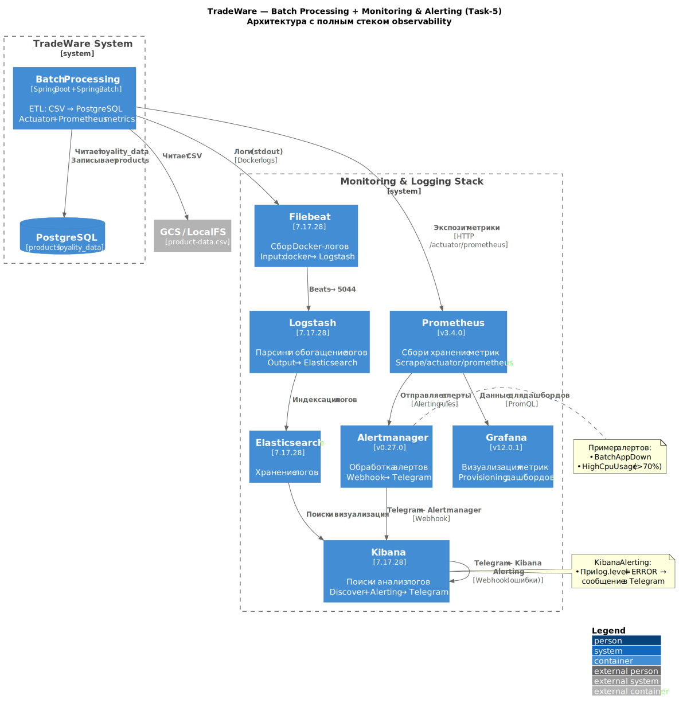
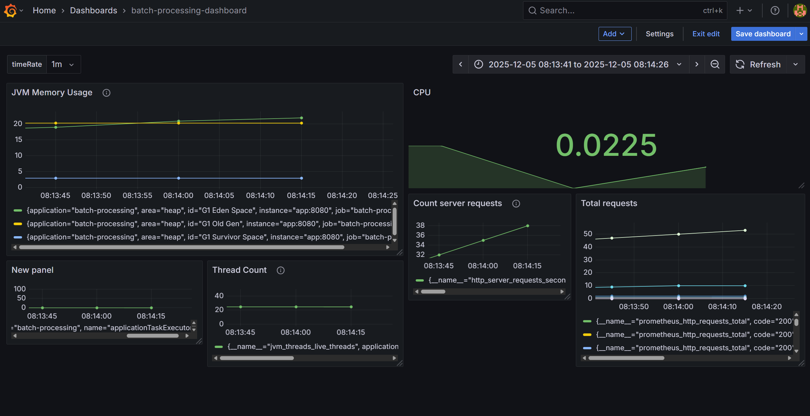
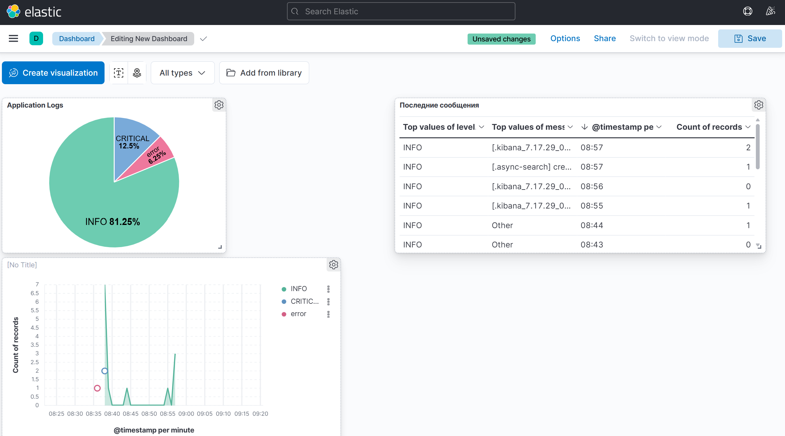
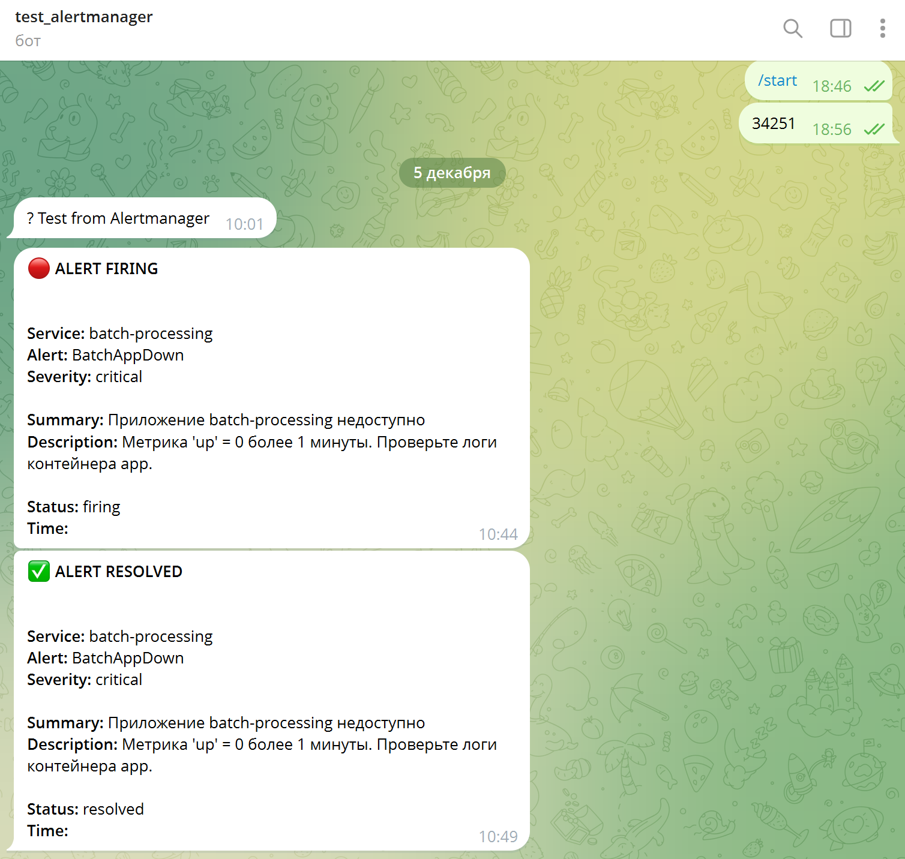

# Задание 5 — Мониторинг, логирование и алертинг Batch Processing микросервиса

## Цель задания
Настроить полный observability-стек для Spring Batch приложения:
- Сбор и визуализация метрик
- Централизованное логирование всех контейнеров
- Оповещения в Telegram при падении сервиса, высокой нагрузке и при появлении ошибок в логах

## Запущенный стек
```text
app            Up 12 minutes   0.0.0.0:8080->8080/tcp
grafana        Up (healthy)    0.0.0.0:3000->3000/tcp
prometheus     Up (healthy)    0.0.0.0:9090->9090/tcp
alertmanager   Up (healthy)    0.0.0.0:9093->9093/tcp
filebeat       Up (healthy)
logstash       Up (healthy)    0.0.0.0:5044->5044/tcp
kibana         Up (healthy)    0.0.0.0:5601->5601/tcp
elasticsearch  Up (healthy)    0.0.0.0:9200->9200/tcp
postgresdb     Up (healthy)    0.0.0.0:5432->5432/tcp
```
См. также файл: [docker_ps.log](docker_ps.log)

## Архитектура (C4 Container Diagram)



Исходник диаграммы: [C4-диаграмма.puml](C4-диаграмма.puml)

## Метрики — Prometheus + Alertmanager + Grafana

- Приложение экспозит метрики через Spring Boot Actuator (`/actuator/prometheus`)
- Prometheus скрейпит цель `app:8080` каждые 5 секунд  
  → [prom_targets.png](prom_targets.png) — цель UP  
  → [prom_metrics.png](prom_metrics.png) — пример метрик  
  → [prom_alerts.png](prom_alerts.png) — настроенные правила алертинга
- Настроены алерты:
  - `BatchAppDown` — сервис недоступен
  - `HighCpuUsage` — CPU > 70% более 2 минут
- Alertmanager отправляет алерты в Telegram через webhook



## Централизованное логирование — EFK + Filebeat + Logstash

- Filebeat собирает stdout/stderr всех контейнеров
- Логи → Logstash (порт 5044) → Elasticsearch → Kibana
- Создан index pattern `filebeat-*`



## Алертинг в Telegram

Реализовано **два независимых канала**:

- **Prometheus + Alertmanager → Telegram**  
   (падение сервиса, высокая нагрузка)

Пример пришедших оповещений:



## Обоснование выбора технологий

| Компонент       | Выбор                      | Почему именно он                                                                     |
| --------------- | -------------------------- | ------------------------------------------------------------------------------------ |
| Prometheus      | + Alertmanager + Grafana   | Де-факто стандарт для метрик в облачных системах, отличная интеграция с Spring Boot  |
| Filebeat        | вместо Fluent Bit          | Лёгкий официальный агент Elastic, минимум конфигурации, надёжно собирает Docker-логи |
| Logstash        | вместо прямого вывода в ES | Возможность сложной обработки и фильтрации логов в будущем                           |
| Alertmanager    | для метрик                 | Дедупликация, группировка, шаблоны, подавление шумов — всё из коробки                |
| Kibana Alerting | для логов                  | Самый быстрый способ настроить алерты по логам без дополнительных сервисов           |
| Telegram        | единый канал оповещений    | Все разработчики уже в чате, поддержка HTML, мгновенная доставка                     |

## Как запустить

```bash
docker-compose up --build -d
```

### Доступ к сервисам
- Grafana:         http://localhost:3000 (admin / admin)
- Prometheus:      http://localhost:9090
- Alertmanager:    http://localhost:9093
- Kibana:          http://localhost:5601

## Результаты (папка results)

- [docker_ps.log](docker_ps.log)
- [C4-диаграмма.svg](C4-диаграмма.svg) и [C4-диаграмма.puml](C4-диаграмма.puml)
- [prom_targets.png](prom_targets.png)
- [prom_metrics.png](prom_metrics.png)
- [prom_alerts.png](prom_alerts.png)
- [grafana_dashboards.png](grafana_dashboards.png)
- [elastic_dashboards.png](elastic_dashboards.png)
- [TG-alerts.png](TG-alerts.png)