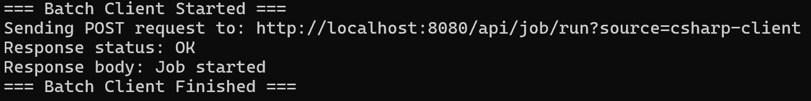
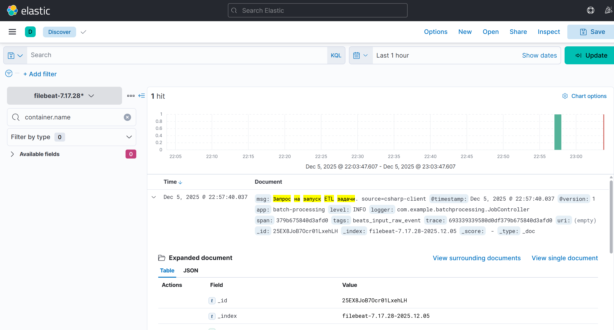
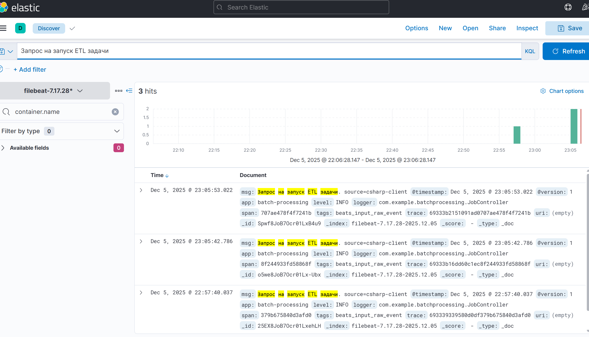
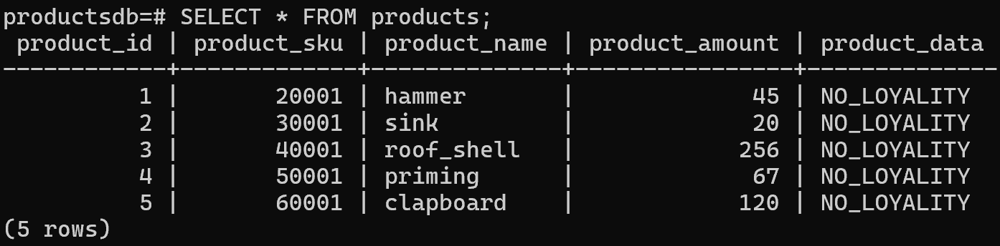
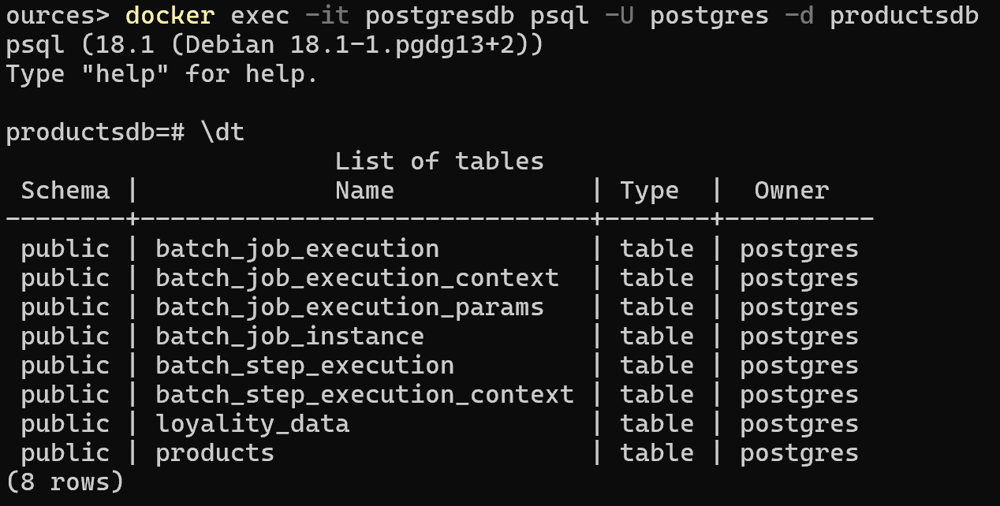

# Задание 6: Реализация трейсинга запросов

## Цель
Реализовать API для запуска ETL-задачи Spring Batch и обеспечить сквозной трейсинг запроса с логированием `traceId`, `spanId` и URI. Логи должны централизованно собираться в ELK-стеке и отображаться в Kibana.

## Архитектура решения

- **Клиент**: консольное приложение на C#, выполняющее HTTP-запрос к API
- **Сервер**: Spring Boot + Spring Batch с Micrometer Tracing (Brave)
- **Трейсинг**: `@NewSpan` + MDC + `traceId`/`spanId` в JSON-логах
- **Логирование**: Logback + Logstash Encoder → stdout → Filebeat → Logstash → Elasticsearch
- **Визуализация**: Kibana → Discover

## Реализованные компоненты

### 1. REST API (`JobController.java`)
```java
@RestController
@RequestMapping("/api/job")
public class JobController {
    @NewSpan("start-batch-job")
    @PostMapping("/run")
    public String runJob(@RequestParam(defaultValue = "manual") String source) {
        log.info("Запрос на запуск ETL задачи. source={}", source);
        // Запуск задачи через JobLauncher
    }
}
```

### 2. Трейсинг и логирование (`logback-spring.xml`)
- Интеграция с Micrometer Tracing
- Автоматическое извлечение `traceId`, `spanId` из контекста Brave
- Форматирование логов в JSON с включением:

### 3. Клиент на C#
```csharp
var client = new HttpClient();
var response = await client.PostAsync("http://localhost:8080/api/job/run?source=csharp-client", null);
```

## Демонстрация работы

### 1. Вызов API из C#-клиента


Клиент успешно вызывает эндпоинт `/api/job/run` с параметром `source=csharp-client`.

### 2. Отображение трейса в Kibana (один запрос)


В логах отображаются:
- `trace` — уникальный идентификатор всего запроса
- `span` — идентификатор операции `start-batch-job`
- `msg` — информативное сообщение с источником запроса

### 3. Отображение трейса в Kibana (три запроса)


Каждый вызов генерирует уникальный `traceId`, что позволяет отдельно отслеживать каждый запрос.

### 4. Данные в PostgreSQL
#### Таблица `products` после обработки


Таблица содержит обновлённые данные: поле `product_data` заполнено значениями из таблицы `loyality_data`.

#### Структура БД


Созданы две таблицы:
- `products` — результирующая таблица ETL
- `loyality_data` — справочник для обогащения данных
